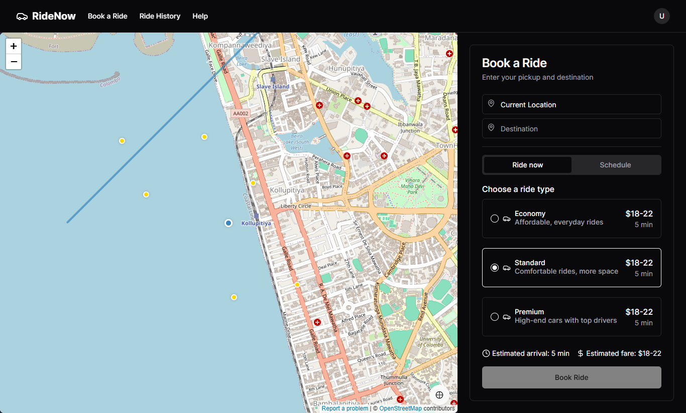

# RideNow - Uber Clone with Next.js



A full-featured Uber clone built with Next.js, featuring real-time location tracking, interactive maps, and Stripe payment integration.

## 🚀 Features

- **Real-time Location Tracking**: Uses browser geolocation to track user's current position
- **Interactive Maps**: Displays user location, destination, and nearby drivers
- **Ride Booking Flow**: Complete flow from selecting pickup/destination to completing a ride
- **Multiple Ride Types**: Economy, Standard, and Premium options with different pricing
- **Stripe Payment Integration**: Secure payment processing with Stripe
- **Ride History**: View past rides with details
- **Responsive Design**: Works seamlessly on mobile and desktop devices
- **Dark Mode Support**: Built-in dark mode for better user experience

## 🛠️ Technologies Used

- **Next.js**: React framework for server-rendered applications
- **React**: JavaScript library for building user interfaces
- **TypeScript**: Static type-checking for JavaScript
- **Tailwind CSS**: Utility-first CSS framework
- **shadcn/ui**: High-quality UI components built with Radix UI and Tailwind
- **OpenStreetMap**: Free and open-source map data
- **Stripe**: Payment processing platform
- **Lucide Icons**: Beautiful open-source icons

## 📋 Prerequisites

- Node.js 16.8.0 or later
- npm or yarn
- Stripe account (for payment processing)

## 🔧 Installation

1. Clone the repository:
   ```bash
   git clone https://github.com/sithum20210380/Uber-Clone.git
   cd Uber-Clone

2. Install dependencies:

```shellscript
npm install
# or
yarn install
```


3. Set up environment variables:
Create a `.env.local` file in the root directory with the following variables:

```plaintext
NEXT_PUBLIC_STRIPE_PUBLISHABLE_KEY=your_stripe_publishable_key
STRIPE_SECRET_KEY=your_stripe_secret_key
```


4. Run the development server:

```shellscript
npm run dev
# or
yarn dev
```


5. Open [http://localhost:3000](http://localhost:3000) in your browser to see the application.


## 🚗 Usage

### Booking a Ride

1. Navigate to the "Book a Ride" page
2. Allow location access when prompted
3. Enter your destination
4. Select a ride type (Economy, Standard, or Premium)
5. Click "Book Ride"
6. Complete payment using test card details:

1. Card number: 4242 4242 4242 4242
2. Any future expiration date
3. Any 3-digit CVC


### Viewing Ride History

1. Navigate to the "Ride History" page
2. View a list of your past rides
3. Click on any ride to see detailed information


## 📁 Project Structure

```
ridenow-uber-clone/
├── app/                  # Next.js app directory
│   ├── globals.css       # Global styles
│   ├── layout.tsx        # Root layout component
│   ├── page.tsx          # Home page
│   ├── ride/             # Ride booking pages
│   └── history/          # Ride history pages
├── components/           # Reusable components
│   ├── ui/               # UI components from shadcn/ui
│   ├── navbar.tsx        # Navigation bar
│   ├── simple-map.tsx    # Map component
│   └── ...
├── public/               # Static assets
└── ...
```

## 🔮 Future Enhancements

- **User Authentication**: Add login/signup functionality
- **Real-time Driver Updates**: Implement WebSockets for real-time location updates
- **Address Autocomplete**: Integrate with a geocoding service for better address input
- **Driver App**: Create a companion app for drivers
- **Push Notifications**: Add notifications for ride updates
- **Ride Sharing**: Allow users to share rides with others
- **Multiple Payment Methods**: Support for various payment options

## 🙏 Acknowledgements

- [Next.js](https://nextjs.org/)
- [Tailwind CSS](https://tailwindcss.com/)
- [shadcn/ui](https://ui.shadcn.com/)
- [OpenStreetMap](https://www.openstreetmap.org/)
- [Stripe](https://stripe.com/)
- [Lucide Icons](https://lucide.dev/)
```
